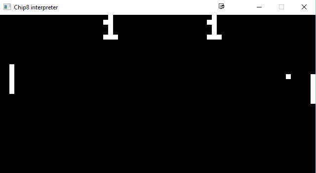
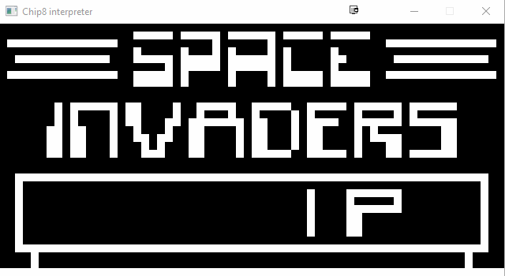

## Chip8 Intrepreter

### Description

A chip8 intrepreter created in C++, SDL and openGL.

### Compiling

The required dependencies are included.

1. - Requires Visual Studio 2015 compile the project.
2  - Place glew32.dll, SDL_mixer.h, SDl2.dll and SDL2_mixer.dll into the Release folder
3. - Compile the project in release mode.

### Usage

 - Run the exe, drag roms you want to play into the Window
 - Avaliable key inputs are:
 	1234
 	qwer
 	asdf
 	zxcv

 - Warning due to Mix_VolumeChunk not working the games can be quite loud.

 ### Sample runs

